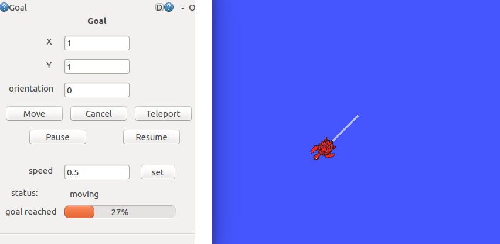

# Ekumen technicall challenge

ROS nodes that makes turtlesim's simulated robot reach specific goals, drawing the path on the screen.


Primary features:

- A node that provides an Actionlib server which receives a goal (2Dpose, including orientation) the turtle should reach.
- The node provides feedback to the 'goal requester', indicating the progress to reach the goal and a status of the turtle. 
- The system has a UI that allows to enter and execute goals for the turtle and provide feedback to the user.
- Provide an Actionlib server which teleport the turtle to the goal.
- Provide services to pause and resume the movement of the turtle.
- Provide a parameter to set the linear speed and angular speed of the turtle.



This ROS nodes and the UI were tested on Ubuntu 16.04 under ROS Kinetic.

## Getting Started

If your system does not have ROS installed follow these tutorial to 
[install ROS and create a catking workspace](http://wiki.ros.org/ROS/Tutorials/InstallingandConfiguringROSEnvironment).


### Prerequisites


Dependencies:

- actionlib
- actionlib_msgs
- geometry_msgs
- message_generation
- message_runtime
- rospy
- rqt_gui
- rqt_gui_py
- std_msgs
- std_srvs

You can install all with the full version of ROS desktop:

```
sudo apt-get install ros-<version>-desktop-full
```


### Installing

Clone the latest version from this repository into your <catkin workspace>/src directory and 
build it.

```
cd <your catkin workspace>
catkin_make
source devel/setup.bash
```

### Runing

To launch the entire system run the following command

```
roslaunch tech_mvazquez tech_mvazquez.launch
```

To launch the actionlib server.

```
rosrun tech_mvazquez Turtle.py
```

To launch the UI.

```
rosrun tech_mvazquez rqt_tech_mvazquez
```


## Authors

* **Matias Vazquez** - [mfvazquez](https://github.com/mfvazquez)


## License

This project is licensed under the BSD License - see the [LICENSE](https://opensource.org/licenses/BSD-3-Clause) link for details.

## Improvements

- Add multiple turtles
- Add a plot the position of the turtle
- Add a sequence of goals instead of just one 


